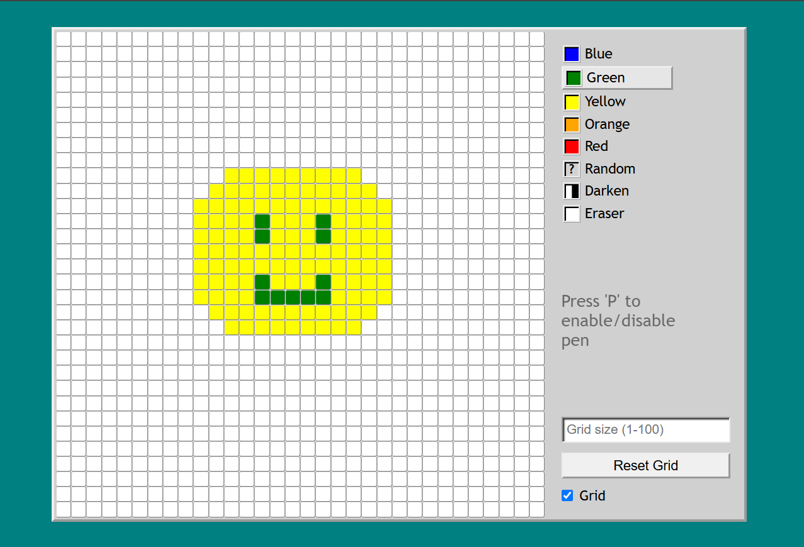
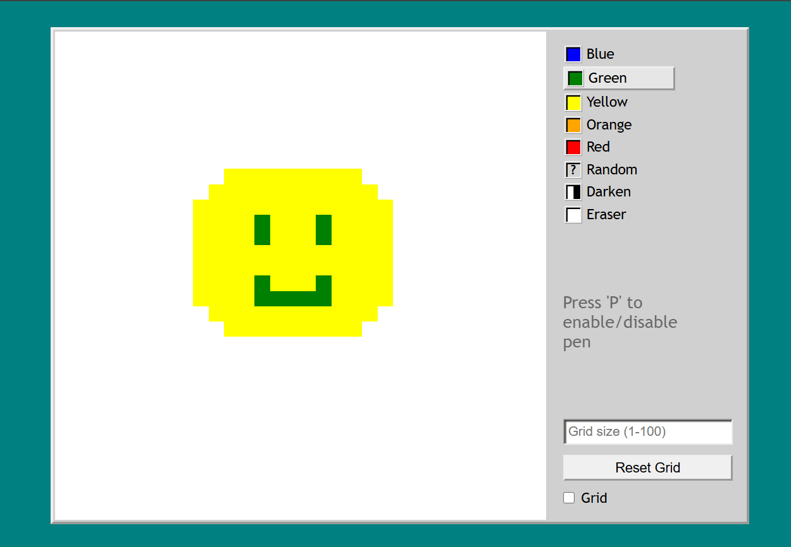

# Etch-A-Sketch

Let your creative and drawing skills out with this fun little game!

Providing a user-friendly interface, this project has many features:

## 1. Colours 
7 different color options, including a random color generator, and a darken color (to give your drawings more shade!)

## 2. Grid Resize option
You can choose the size of the grid, from 1-100. The default size is 32 squares per side.

## 3. Grid Show option
You can show/hide grid anytime to help with their drawings!

## 4. Pen enable/disable option
You can enable/disable your drawing pen. This way you can draw exactly what you want without having to erase again and again!

Feel free to drop any suggestions for future improvements.